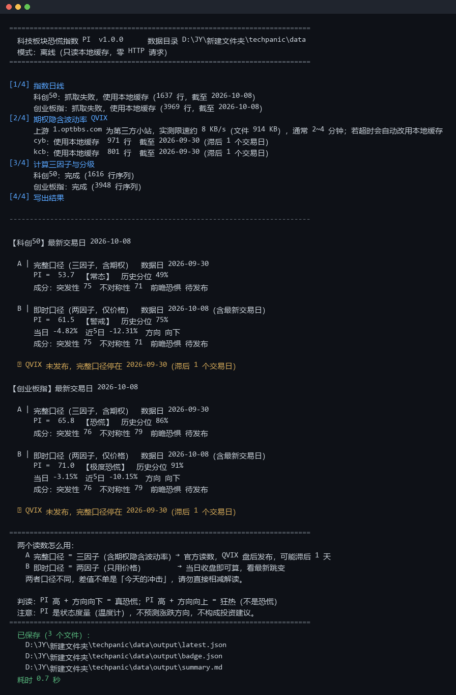

# techpanic · 科技板块恐慌指数 PI

> 一条命令，拿到今天 A 股科技板块的「恐慌读数」。零 API Key、零账号、零配置。

[](https://www.python.org/)
[](LICENSE)
[](tests/)
[](#数据从哪来)

**techpanic** 把「科创50 / 创业板指今天慌不慌」压缩成一个 0–100 的数：
**PI（Panic Index，恐慌指数）**。它把三个已经过学术检验的市场特征
——波动抬升、下跌不对称、期权隐含波动——合成到一个量纲上，
并用历史分位给出**平静 / 常态 / 警戒 / 恐慌 / 极度恐慌**的分级。



---

## 30 秒上手

### 方式一：完全零基础（不用装 Python 以外的东西）

| 系统 | 怎么做 |
|---|---|
| **Windows** | 下载本仓库 → 双击 `start.bat` → 等它跑完 |
| **macOS** | 双击 `start.command`（若被拦截：右键 → 打开） |
| **Linux** | `bash start.sh` |

首次运行会自动创建独立环境、装好依赖（约 2–5 分钟），之后每次都快得多。
**你不需要懂命令行、不需要注册账号、不需要申请 Key、不需要改任何配置。**

### 方式二：会用命令行

```bash
git clone https://github.com/jymadrid/techpanic.git
cd techpanic
python -m venv .venv
.venv/Scripts/activate        # Windows；macOS/Linux 用 source .venv/bin/activate
pip install -r requirements.txt
python -m techpanic
```

### 方式三：装成命令

```bash
pip install .
techpanic            # 直接敲名字就能跑
```

### 只看不装：Google Colab

打开 [`notebooks/quickstart_colab.ipynb`](notebooks/quickstart_colab.ipynb)，
点一下「全部运行」，不必在本机装任何东西。

---

## 它会输出什么

```
【科创50】最新交易日 2026-10-08

  A | 完整口径（三因子，含期权）  数据日 2026-09-30
      PI =  53.7  【常态】  历史分位 49%
      成分：突发性 75  不对称性 71  前瞻恐惧 待发布

  B | 即时口径（两因子，仅价格）  数据日 2026-10-08（含最新交易日）
      PI =  61.5  【警戒】  历史分位 75%
      当日 -4.82%  近5日 -12.31%  方向 向下
      成分：突发性 75  不对称性 71  前瞻恐惧 待发布

  ⚠ QVIX 未发布，完整口径停在 2026-09-30（滞后 1 个交易日）
```

同时写出 **7 个文件**到 `data/output/`（2 个标的 × (CSV + JSON)，外加 3 个汇总文件）：

| 文件 | 用途 |
|---|---|
| `summary.md` | 本次运行摘要表，可直接贴进笔记 |
| `latest.json` | 机器可读快照（schema v1），给程序/CI 用 |
| `badge.json` | shields.io endpoint 徽章数据 |
| `panic_index_tech_kcb.csv` | 科创50 全历史序列（Excel 双击可开，中文不乱码） |
| `panic_index_tech_cyb.csv` | 创业板指全历史序列 |
| `panic_index_tech_kcb.json` | 科创50 的单标的 JSON 快照 |
| `panic_index_tech_cyb.json` | 创业板指的单标的 JSON 快照 |

终端会以「已保存（7 个文件）」把**逐标的产物**和**汇总产物**一起列出。
加 `--with-sse50` 会再增加上证50的 CSV 与 JSON。

---

## 两个读数是这个项目最重要的一件事

| | A 完整口径 | B 即时口径 |
|---|---|---|
| 因子 | 三因子：波动抬升 + 下跌不对称 + **期权隐含波动** | 两因子：波动抬升 + 下跌不对称 |
| 权重 | 0.40 / 0.35 / 0.25 | (0.40 + 0.35) / 0.75 |
| 数据日 | QVIX 盘后发布，**常滞后 1 个交易日** | 当日收盘即可算 |
| 用途 | 官方读数、历史研究、报告引用 | 看最新跳变、当日盘中情绪 |

> ⚠️ **两者口径不同，请勿直接相减。**
> 「A=53.7，B=61.5，所以今天冲击 +7.8」是**错的**——
> 那 7.8 里混着「口径差异」和「时间差异」，无法拆开。
> 想知道今天真实的新增冲击，看 B 的**变化量**（与昨天的 B 比），不是 A 与 B 的差。

---

## 判读：PI 高不等于恐慌

PI 衡量的是**状态**，不是**方向**。同一个高分，配合不同方向含义完全相反：

| PI 水平 | 方向 | 该怎么读 |
|---|---|---|
| 高 | 向下 | **这才是恐慌**：在跌，而且市场自己在放大恐慌 |
| 高 | 向上 | **狂热**：在涨，但波动也在放大，不是恐慌 |
| 低 | — | 市场平静，无论涨跌 |

所以每条读数都同时给出 `方向`（由近 5 日涨跌判定），请**两个一起看**。

> PI 是温度计，不是预言机。它不预测涨跌，不构成投资建议。
> 详见 [DISCLAIMER.md](DISCLAIMER.md)。

---

## 数据从哪来

**全部来自公开免费接口，不需要任何账号、API Key 或付费。**

| 数据 | 来源 | 获取方式 | 实测 |
|---|---|---|---|
| 指数日线 | 新浪财经 | `akshare.stock_zh_index_daily()` | ~0.8 秒，1637 行 |
| QVIX 期权隐含波动率 | 1.optbbs.com | 直接下载 914 KB 的 CSV 宽表 | **1.7 秒 ~ 123 秒，波动极大** |

### 三条必须知道的实话

1. **首次运行必须联网。** 本仓库**不附带任何数据**（有意为之：数据会过期，
   附带数据反而让人误以为是最新的）。没有网络且没有缓存时，程序会明确报
   「无可用数据」并给出下一步，**不会**假装成功。
2. **QVIX 上游是单点。** `1.optbbs.com` 是一个第三方小站，只有 HTTP，服务端
   限速约 8 KB/s，实测同一个文件有时 1.7 秒、有时 123 秒。程序对此的处理是：
   给足 150 秒单次超时 / 300 秒总预算，**超时立刻降级用本地缓存**并明确标注
   「完整口径滞后 N 个交易日」。这不是 bug，是设计。
3. **上游列结构可能变。** QVIX 的列号是硬编码的切片，一旦上游改版就会取错列。
   程序用三道防线拦截（见下），但如果你发现读数突然离谱，请先看
   [docs/DATA_SOURCES.md](docs/DATA_SOURCES.md) 的自检步骤。

### 三道防错防线

| 防线 | 拦什么 |
|---|---|
| **列数断言** | 上游删列 → 显式拒绝，而不是静默取到错列 |
| **合理性断言** | 取值不像波动率指数（中位数、负值、样本跨度）→ 拒绝 |
| **与本地缓存交叉校验** | 重叠日期对不上 → 拒绝新数据，改用缓存（**最容易漏、也最危险的一类故障**） |

---

## 常用命令

```bash
python -m techpanic                     # 默认：抓取 + 计算 + 打印
python -m techpanic --offline           # 只用本地缓存，零 HTTP 请求
python -m techpanic --refresh           # 忽略缓存，强制重抓
python -m techpanic --json              # 输出 JSON 到标准输出（给 CI / 脚本用）
python -m techpanic --date 2026-09-30   # 只用到该日期为止的数据（回测/复核）
python -m techpanic --with-sse50        # 额外算上证50（非科技，仅验证方法）
python -m techpanic --check             # 只做环境与数据源自检，不计算
python -m techpanic --quiet             # 安静模式
python -m techpanic --debug             # 失败时打印完整堆栈（报 issue 时用）
```

### 退出码

| 码 | 含义 | 该做什么 |
|---|---|---|
| `0` | 完全成功，两个口径都是最新数据 | 无 |
| `2` | **部分降级**（QVIX 滞后 / 用了缓存） | 看输出里的 ⚠ 说明，通常无需处理 |
| `3` | 无可用数据（无网络且无缓存） | 检查网络后重跑 |
| `4` | 运行环境问题（依赖缺失/版本不符） | 按提示 `pip install -r requirements.txt` |
| `5` | 参数错误 | 看 `--help` |
| `130` | 你按了 Ctrl+C | 无 |

> **退出码 2 是正常状态，不是失败。** QVIX 盘后发布，滞后 1 个交易日是常态。

---

## 想改配置？

**不改也能用。** 想改的话：

```bash
cp config.toml.example data/config.toml
```

然后编辑 `data/config.toml`。优先级：**命令行 > 环境变量 > TOML > 内置默认值**。
完整字段说明见 [docs/CONFIGURATION.md](docs/CONFIGURATION.md)。

最常见的两个需求：

```toml
# 1. 走代理（公司网络）
[network]
proxy = "http://127.0.0.1:7890"

# 2. 换成固定阈值分级，让读数可复现、可对外引用
[index]
level_anchor = "frozen"
[index.frozen_anchors]
p25 = 30.0
p50 = 42.0
p75 = 58.0
p90 = 72.0
```

---

## 项目结构

```
techpanic/
├── start.bat / start.command / start.sh   # 一键启动（零基础用户入口）
├── config.toml.example                    # 配置模板（可选）
├── requirements.txt                       # 精确锁定的依赖版本
├── src/techpanic/
│   ├── cli.py          # 命令行入口、退出码、中文兜底提示
│   ├── pipeline.py     # 编排：抓取 → 缓存 → 计算 → 输出（含降级阶梯）
│   ├── index.py        # 核心算法：三因子 → PI
│   ├── levels.py       # 分级锚点（扩展窗口，严格无前视）
│   ├── report.py       # CSV / JSON / 摘要输出
│   ├── store.py        # 原子写、备份轮转、数据校验
│   ├── ui.py           # 终端界面（零依赖）
│   ├── config.py       # TOML + 环境变量 + 命令行三层配置
│   ├── errors.py       # 异常 → 退出码映射
│   └── fetch/          # 数据抓取（http / index_daily / qvix）
├── tests/              # 118 个测试，含 3 个「坏数据」负例
├── docs/               # 方法学、数据源、配置、验证、FAQ
├── examples/           # 可直接运行的示例脚本
└── notebooks/          # Colab 快速上手
```

---

## 常见问题

**Q：为什么 A 和 B 不一样？是不是有一个错了？**
不是。A 含期权数据、数据日更早；B 只用价格、数据日最新。两个都对，见上文对照表。

**Q：为什么第一次跑要等好几分钟？**
卡在 QVIX 下载。上游限速约 8 KB/s，914 KB 的文件确实要 2–4 分钟。
之后用缓存就很快了。急着看结果可以 `--offline`。

**Q：能拿到多少历史？**
科创50 自 2020 年起，创业板指自 2010 年起（受数据源限制）。

**Q：能加别的板块吗？**（半导体、新能源、北证50…）
能。改 `config.toml` 的 `[targets.*]`，但需要该指数有对应的 QVIX 期权数据，
否则只能出即时口径。细节见 [docs/CONFIGURATION.md](docs/CONFIGURATION.md)。

**Q：结果和官方指数一致吗？**
**不是官方指数。** 这是一个研究/观测级度量，由本项目的公式与公开数据计算得出，
与任何交易所或机构的官方发布无关。

**Q：数据准吗？**
指数日线来自新浪财经，与公开行情一致；QVIX 来自第三方小站，我们做了三道校验，
但无法为上游数据质量背书。**用于严肃研究前请自行交叉验证。**

更多问题见 [docs/FAQ.md](docs/FAQ.md)。

---

## 参与贡献

欢迎提 Issue 和 PR ——尤其是这几类：

- 发现**新的免费公开数据源**（能替代或补充 1.optbbs.com）
- 上游接口变更导致抓取失败（附上错误信息）
- 方法学上的质疑（请附推导或反例）
- 文档/翻译改进

提交前请先跑：

```bash
pip install -r requirements-dev.txt
pytest
ruff check src tests
```

详见 [CONTRIBUTING.md](CONTRIBUTING.md)。

---

## 项目怎么来的

本项目的算法与判读框架来自一份中文量化研究文档《科技板块恐慌指数 PI》。
开源化过程中做了三件事：

1. **修正了一处真实缺陷**：原实现在 QVIX 缺失日会把旧值继续向前携带，
   导致「完整口径」显示上一交易日的数。本项目显式置为缺值。
   （差异说明见 [tests/test_regression_reference.md](tests/test_regression_reference.md)）
2. **把「灰度」变成一等公民**：降级、滞后、缓存全部在输出里显式标注，绝不静默。
3. **把「可信」变成可验证的**：118 个测试，含因果性测试（接上未来数据后历史读数必须不变）
   和 3 个坏数据负例。

方法学细节与推导见 [docs/METHODOLOGY.md](docs/METHODOLOGY.md)。
与参考实现的逐项对照见 [docs/VALIDATION.md](docs/VALIDATION.md)。

---

## 文档索引

| 文档 | 内容 |
|---|---|
| [快速上手](docs/QUICKSTART.md) | 从零开始的详细步骤、常见卡点排查 |
| [配置说明](docs/CONFIGURATION.md) | 每个配置项的含义、三层优先级 |
| [数据源](docs/DATA_SOURCES.md) | 接口细节、已知风险、自检与排障 |
| [方法学](docs/METHODOLOGY.md) | 公式推导、为什么这么设计、局限 |
| [验证](docs/VALIDATION.md) | 与参考实现的对照、测试覆盖、回归基准 |
| [常见问题](docs/FAQ.md) | 使用与判读问题 |
| [术语表](docs/GLOSSARY.md) | 指标与统计术语 |
| [English README](README.en.md) | English overview |

---

## 免责声明（务必阅读）

本项目是**研究/观测工具**，不是投资建议、不是官方指数、不预测涨跌方向。

- 所有数据来自第三方公开接口，**我们不保证其准确性、完整性或持续可用**。
- 任何投资决策应由你自己做出并承担全部后果。
- 作者与贡献者不对因使用本软件产生的任何损失承担责任。

完整条款见 [DISCLAIMER.md](DISCLAIMER.md)。

---

## 许可

[MIT](LICENSE) © 2026 techpanic contributors

本仓库**只包含代码**，不包含任何数据文件、数据快照或数据镜像。
运行所需的全部数据在运行时从公开接口获取。
